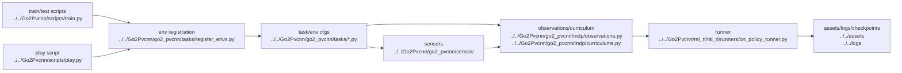

# AI Overall Pipeline

## Navigation

- doc role: AI pipeline overview
- paired human doc: [../human/human-01-overall-pipeline.md](../human/human-01-overall-pipeline.md)
- previous: [ai-00-reading-guide.md](ai-00-reading-guide.md)
- next: [ai-02-training-and-entrypoints.md](ai-02-training-and-entrypoints.md)
- master index: [../index.md](../index.md)

## Summary

The active project pipeline starts from repository scripts, builds Isaac Lab task/env configs, assembles robot-state and LiDAR observations, extracts PVCNN-backed features, and passes them into the `rsl_rl` PPO runner that writes checkpoints and logs.

## Stage Graph

## Key Boundaries

- active implementation target: `Go2Pvcnn/`
- repository notes root: `notes/`
- reference-only by default: `raw/`, `onlyReference/`
- vendored code boundary: `third_party/`

## Primary Files

- `Go2Pvcnn/scripts/train_go2_pvcnn.py`
- `Go2Pvcnn/go2_pvcnn/tasks/`
- `Go2Pvcnn/go2_pvcnn/sensor/lidar/`
- `Go2Pvcnn/go2_pvcnn/pvcnn_wrapper.py`
- `Go2Pvcnn/rsl_rl/rsl_rl/runners/on_policy_runner.py`
- `Go2Pvcnn/rsl_rl/rsl_rl/algorithms/ppo.py`
