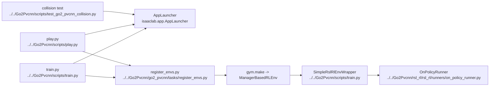

# AI Training And Entrypoints

## Navigation

- doc role: AI stage note
- paired human doc: [../human/human-02-training-and-entrypoints.md](../human/human-02-training-and-entrypoints.md)
- previous: [ai-01-overall-pipeline.md](ai-01-overall-pipeline.md)
- next: [ai-03-environment-and-observations.md](ai-03-environment-and-observations.md)
- master index: [../index.md](../index.md)

## Purpose

Index the main repository scripts and identify which ones select configs, launch training/playback, or run specialized tests.

## Code Graph

## Candidate Files

- `Go2Pvcnn/scripts/train.py`
- `Go2Pvcnn/scripts/train_go2_pvcnn.py`
- `Go2Pvcnn/scripts/play.py`
- `Go2Pvcnn/scripts/test_go2_pvcnn_collision.py`
- `Go2Pvcnn/scripts/test_go2_lidar.sh`

## Inputs

- CLI args
- environment variables
- checkpoint paths
- env cfg selection

## Outputs

- configured Isaac Lab environment
- wrapped RL env
- selected run mode
