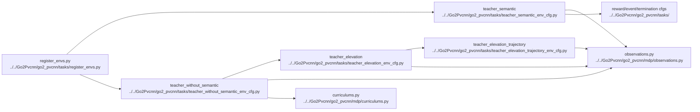

# AI Environment And Observations

## Navigation

- doc role: AI stage note
- paired human doc: [../human/human-03-environment-and-observations.md](../human/human-03-environment-and-observations.md)
- previous: [ai-02-training-and-entrypoints.md](ai-02-training-and-entrypoints.md)
- next: [ai-04-lidar-and-pvcnn.md](ai-04-lidar-and-pvcnn.md)
- master index: [../index.md](../index.md)

## Purpose

Track where task configs, scene configs, observations, rewards, and curriculum are defined and how they feed later stages.

## Code Graph

## Candidate Files

- `Go2Pvcnn/go2_pvcnn/tasks/`
- `Go2Pvcnn/go2_pvcnn/mdp/curriculums.py`

## Inputs

- selected env cfg
- robot and terrain config
- sensor config

## Outputs

- policy observations
- critic observations
- curriculum state
