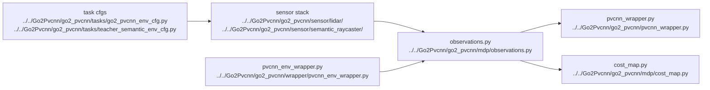

# AI LiDAR And PVCNN

## Navigation

- doc role: AI stage note
- paired human doc: [../human/human-04-lidar-and-pvcnn.md](../human/human-04-lidar-and-pvcnn.md)
- previous: [ai-03-environment-and-observations.md](ai-03-environment-and-observations.md)
- next: [ai-05-ppo-and-runner.md](ai-05-ppo-and-runner.md)
- master index: [../index.md](../index.md)

## Purpose

Track the flow from LiDAR / ray caster outputs into PVCNN feature extraction and note the main integration seams.

## Code Graph

## Candidate Files

- `Go2Pvcnn/go2_pvcnn/sensor/lidar/`
- `Go2Pvcnn/go2_pvcnn/pvcnn_wrapper.py`
- `Go2Pvcnn/go2_pvcnn/wrapper/pvcnn_env_wrapper.py`

## Inputs

- point clouds
- LiDAR configs
- PVCNN checkpoint path

## Outputs

- feature tensors
- observation fields
- optional supervision data for PVCNN training
