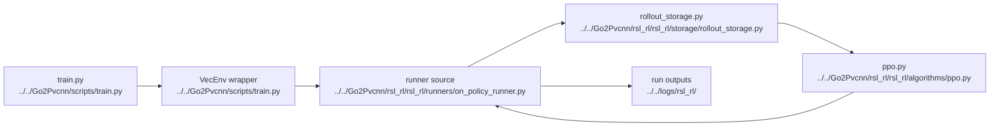

# AI PPO And Runner

## Navigation

- doc role: AI stage note
- paired human doc: [../human/human-05-ppo-and-runner.md](../human/human-05-ppo-and-runner.md)
- previous: [ai-04-lidar-and-pvcnn.md](ai-04-lidar-and-pvcnn.md)
- next: [ai-06-assets-paths-and-experiments.md](ai-06-assets-paths-and-experiments.md)
- master index: [../index.md](../index.md)

## Purpose

Index the PPO update loop, rollout storage, checkpoint handling, and clarify that the active teacher scripts import `rsl_rl_2_01.runners.OnPolicyRunner` even though the tracked source sits under the vendored `Go2Pvcnn/rsl_rl/` tree.

## Code Graph

## Candidate Files

- `Go2Pvcnn/rsl_rl/rsl_rl/runners/on_policy_runner.py`
- `Go2Pvcnn/rsl_rl/rsl_rl/algorithms/ppo.py`
- `Go2Pvcnn/rsl_rl/rsl_rl/storage/rollout_storage.py`
- `Go2Pvcnn/rsl_rl/rsl_rl/storage/replay_buffer.py`

The isolated Parallelism AMP continuation is documented in [T304](../todo/T304-parallelism-amp.md) and the [Chinese AMP design](../../docs/superpowers/specs/2026-08-27-parallelism-joint-amp-design-zh.html); it adds masked dual-value/discriminator paths without changing pure PPO or distillation classes.

## Inputs

- observations
- rewards
- dones
- policy / critic tensor groups
- legacy PVCNN branch semantic supervision payloads

## Outputs

- updated actor/critic
- checkpoints
- metrics

## Runtime Import Note

- active scripts: `train.py` and `play.py` import `OnPolicyRunner` from `rsl_rl_2_01.runners`
- tracked implementation source for note reading still lives under `Go2Pvcnn/rsl_rl/rsl_rl/`
- optional synchronous PVCNN training is mostly relevant to the older dedicated PVCNN branch, not the default teacher mainline
