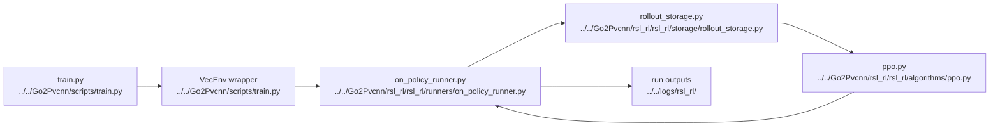

# AI PPO And Runner

## Navigation

- doc role: AI stage note
- paired human doc: [../human/human-05-ppo-and-runner.md](../human/human-05-ppo-and-runner.md)
- previous: [ai-04-lidar-and-pvcnn.md](ai-04-lidar-and-pvcnn.md)
- next: [ai-06-assets-paths-and-experiments.md](ai-06-assets-paths-and-experiments.md)
- master index: [../index.md](../index.md)

## Purpose

Index the PPO update loop, rollout storage, checkpoint handling, and optional synchronous PVCNN training.

## Code Graph

## Candidate Files

- `Go2Pvcnn/rsl_rl/rsl_rl/runners/on_policy_runner.py`
- `Go2Pvcnn/rsl_rl/rsl_rl/algorithms/ppo.py`
- `Go2Pvcnn/rsl_rl/rsl_rl/storage/rollout_storage.py`
- `Go2Pvcnn/rsl_rl/rsl_rl/storage/replay_buffer.py`

## Inputs

- observations
- rewards
- dones
- feature tensors or semantic supervision payloads

## Outputs

- updated actor/critic
- checkpoints
- metrics
