# AI Extension Planner Runtime

## Navigation

- doc role: AI runtime reference for batched planner
- paired human doc: [../human/human-10-extension-planner-runtime.md](../human/human-10-extension-planner-runtime.md)
- previous: [ai-09-extension-planner-mapping.md](ai-09-extension-planner-mapping.md)
- next: [ai-11-extension-trajectory-reward.md](ai-11-extension-trajectory-reward.md)
- master index: [../index.md](../index.md)
- raw index: [../../raw/kinematic_footsteps/notes/index.md](../../raw/kinematic_footsteps/notes/index.md)

## Runtime Pattern

Updated 2026-04-15: planner-owned reference cache with single-shot, per-env masked replanning.

## Main Flow

- Isaac Lab robot state
- high-resolution `height_scanner`
- `extension.batched_planner.manager.BatchedTrajectoryManager.refresh_from_env(env)`
- optional single planner call per refresh: `extension.batched_planner.trajectory.batched_generate_trajectory`
- `extension.convention.planner_result_to_reference_cache` (canonical `ReferenceTrajectoryCache`)
- full-shaped cache `(num_envs, horizon, ...)` is consumed by reward/viewer

## Runtime Graph

```mermaid
graph LR
    env["trajectory env cfg\n../../Go2Pvcnn/go2_pvcnn/tasks/teacher_elevation_trajectory_env_cfg.py"]
    convention["convention.py\n../../Go2Pvcnn/extension/convention.py"]
    traj["trajectory.py\n../../Go2Pvcnn/extension/batched_planner/trajectory.py"]
    manager["manager.py\n../../Go2Pvcnn/extension/batched_planner/manager.py"]
    cache["planner-owned ReferenceTrajectoryCache\n(env.unwrapped._trajectory_manager.refresh_from_env)\n+ runtime mirror: env.unwrapped._trajectory_reference_cache"]
    reward["rewards_reference.py\n../../Go2Pvcnn/extension/mdp/rewards_reference.py"]

    env --> convention
    env --> traj
    convention --> traj
    traj --> manager
    manager --> cache
    cache --> reward
```

## Interface Layers

Runtime is not a direct `Isaac -> trajectory.py` call.

- Isaac Lab provides batched robot state, commands, and scanner terrain
- `extension.convention.py` normalizes conventions at the boundary
- `manager.py` owns the cache lifecycle, computes the per-env replan mask, and advances phases
- `trajectory.py` is the planner entrypoint used only when a replan is needed
- `rewards_reference.py` calls `ensure_reference_cache(env)` which requires `env.unwrapped._trajectory_manager`

## Counters

- `_step_counter`: global, not reset per env
- `_phase_counter`: per-env current reference frame
- `_last_episode_length_buf`: last refresh episode steps
- `_last_replan_episode_length_buf`: per-env last (attempted) replan episode steps (for interval bookkeeping)
- `_pending_reset_mask`: per-env pending reset flags

## Replan Trigger

Per-env masked replanning (decoupled semantics):

- reset / pending reset: only those env rows are replanned
- command delta: only env rows with changed commands are replanned
- interval elapsed: per env if `episode_length_buf - last_replan_episode_length_buf >= reference_replan_interval_steps`
- cache/horizon mismatch: falls back to a full replan for safety

## Cache Contract

Reward/viewer consume `ReferenceTrajectoryCache`, not the raw planner result, and they expect a full-shaped cache:

- even partial replans keep the cache layout `(num_envs, horizon, ...)`
- manager writes replanned rows back into the full cache via masked writes

### Standstill Persistence

If replanning fails for a subset and a cache already exists, the manager fills those rows with a standstill (time-constant) trajectory and keeps them until that env hits its next trigger. Interval bookkeeping is updated so failures do not retrigger every step.

### Verbose Planner Diagnostics

With `verbose_planner` (or `planner_instrumentation`) enabled, the manager prints a compact timing summary every `verbose_planner_interval_steps`.

### Viewer Direct Playback

Viewer supports `--planner-playback-mode direct` to drive robot pose/joints directly from the planner result/reference cache (as opposed to the default `physics` mode).

## CPU vs Pure-GPU Runtime Role

- raw CPU path remains the semantic parity baseline
- batched pure-GPU path is the intended runtime path for Isaac Lab training
- legacy EventTerm / raw bridge runtime should be treated as historical, not default

## Related deep-dive

- swing/stance semantics and IK time complexity (single env, code anchors): [ai-13-batched-planner-swing-stance-ik-complexity.md](ai-13-batched-planner-swing-stance-ik-complexity.md)
