# AI Extension Planner Runtime

## Navigation

- doc role: AI runtime reference for batched planner
- paired human doc: [../human/human-10-extension-planner-runtime.md](../human/human-10-extension-planner-runtime.md)
- previous: [ai-09-extension-planner-mapping.md](ai-09-extension-planner-mapping.md)
- next: [ai-11-extension-trajectory-reward.md](ai-11-extension-trajectory-reward.md)
- master index: [../index.md](../index.md)
- raw index: [../../raw/kinematic_footsteps/notes/index.md](../../raw/kinematic_footsteps/notes/index.md)

## Runtime Pattern

fixed-interval GPU replanning plus cached reference trajectory

## Main Flow

- Isaac Lab robot state
- high-resolution `height_scanner`
- `extension.batched_planner.trajectory.batched_generate_trajectory`
- `extension.batched_planner.manager.BatchedTrajectoryManager`
- `extension.convention.planner_result_to_reference_cache`
- current phase slice
- reward consumption

## Runtime Graph

```mermaid
graph LR
    env["trajectory env cfg\n../../Go2Pvcnn/go2_pvcnn/tasks/teacher_elevation_trajectory_env_cfg.py"]
    convention["convention.py\n../../Go2Pvcnn/extension/convention.py"]
    traj["trajectory.py\n../../Go2Pvcnn/extension/batched_planner/trajectory.py"]
    manager["manager.py\n../../Go2Pvcnn/extension/batched_planner/manager.py"]
    cache["reference cache\nenv.unwrapped._trajectory_reference_cache"]
    reward["rewards_reference.py\n../../Go2Pvcnn/extension/mdp/rewards_reference.py"]

    env --> convention
    env --> traj
    convention --> traj
    traj --> manager
    manager --> cache
    cache --> reward
```

## Interface Layers

Runtime is not a direct `Isaac -> trajectory.py` call.

- Isaac Lab provides batched robot state, commands, and scanner terrain
- `extension.convention.py` normalizes conventions at the boundary
- `trajectory.py` computes planner outputs
- `manager.py` stores cache and advances phase
- `rewards_reference.py` consumes only the current frame

## Counters

- `_step_counter`: global, not reset per env
- `_phase_counter`: per-env current reference frame

## Replan Trigger

only fixed interval:

- step 0
- every `reference_replan_interval_steps`

Not the default path anymore:

- reset-triggered replans
- horizon-end replans
- command-delta replans
- state-divergence replans
- raw `EventTerm` startup / interval replans

## Cache Contract

reward side still consumes `ReferenceTrajectoryCache`, not raw `BatchedTrajectoryResult` directly.

## CPU vs Pure-GPU Runtime Role

- raw CPU path remains the semantic parity baseline
- batched pure-GPU path is the intended runtime path for Isaac Lab training
- legacy EventTerm / raw bridge runtime should be treated as historical, not default
