# Human Overall Pipeline

## 导航

- 文档类型：`human` 总流程总览
- 对应 AI 文档：[../ai/ai-01-overall-pipeline.md](../ai/ai-01-overall-pipeline.md)
- 上一篇：[human-00-reading-guide.md](human-00-reading-guide.md)
- 下一篇：[human-02-training-and-entrypoints.md](human-02-training-and-entrypoints.md)
- 总索引：[../index.md](../index.md)
- 相关代码：[README.md](../../Go2Pvcnn/README.md), [ARCHITECTURE.md](../../Go2Pvcnn/ARCHITECTURE.md), [train_go2_pvcnn.py](../../Go2Pvcnn/scripts/train_go2_pvcnn.py), [on_policy_runner.py](../../Go2Pvcnn/rsl_rl/rsl_rl/runners/on_policy_runner.py)

## 一句话总结

当前仓库的主线，是由训练/测试脚本启动 Isaac Lab 环境，环境把 LiDAR 与机器人状态整理成观测，再由 PVCNN 和 PPO 共同驱动策略学习，最后把权重、日志和实验产物落到固定目录。

## Mermaid 总览图

```mermaid
graph LR
    train["训练/测试脚本\n../../Go2Pvcnn/scripts/train.py"]
    play["回放脚本\n../../Go2Pvcnn/scripts/play.py"]
    register["任务注册\n../../Go2Pvcnn/go2_pvcnn/tasks/register_envs.py"]
    envcfg["任务配置\n../../Go2Pvcnn/go2_pvcnn/tasks/*.py"]
    obs["观测/课程\n../../Go2Pvcnn/go2_pvcnn/mdp/observations.py\n../../Go2Pvcnn/go2_pvcnn/mdp/curriculums.py"]
    sensor["LiDAR / height_scanner\n../../Go2Pvcnn/go2_pvcnn/sensor/"]
    pvcnn["PVCNN 包装器\n../../Go2Pvcnn/go2_pvcnn/pvcnn_wrapper.py\n../../Go2Pvcnn/go2_pvcnn/wrapper/pvcnn_env_wrapper.py"]
    runner["PPO Runner\n../../Go2Pvcnn/rsl_rl/rsl_rl/runners/on_policy_runner.py"]
    outputs["日志/权重/资产\n../../logs\n../../assets\n../../other_model"]

    train -->|"选择 experiment -> env cfg"| register
    play -->|"选择 play env cfg"| register
    register -->|"gym id -> cfg class"| envcfg
    envcfg -->|"构建 scene / commands / rewards"| obs
    envcfg -->|"实例化 RayCaster / LiDAR"| sensor
    sensor -->|"点云/高程图输入"| obs
    obs -->|"可选调用 PVCNN 提特征"| pvcnn
    obs -->|"拼接 policy / critic 观测"| runner
    pvcnn -->|"特征注入 wrapper / obs"| runner
    runner -->|"保存 checkpoint / metrics"| outputs
    outputs -->|"resume / play 时再读取"| train
```

## 大流程

### 阶段 1：入口脚本决定运行模式

入口通常来自 `Go2Pvcnn/scripts/`，例如训练、播放、碰撞测试和 LiDAR 测试脚本。

输出：

- 命令行参数
- 环境配置选择
- checkpoint / asset / log 路径

### 阶段 2：任务配置搭场景和 manager

`go2_pvcnn/tasks/` 下的环境配置类定义机器人、地形、传感器、奖励、终止条件以及训练/播放差异。

输出：

- scene cfg
- observation cfg
- reward cfg
- curriculum 开关和地形采样方式

### 阶段 3：观测链组织机器人状态与课程逻辑

`mdp/` 和相关配置决定命令采样、课程难度、观测拼接和部分运行期行为。

输出：

- policy 观测
- critic 观测
- curriculum 难度推进

### 阶段 4：LiDAR 和 PVCNN 提供感知特征

LiDAR / ray caster 负责采样环境点云，PVCNN 负责把点云变成可供策略消费的特征。

输出：

- point cloud
- semantic / geometric features
- 供 PPO 使用的感知输入

### 阶段 5：PPO runner 驱动训练和可选同步学习

`rsl_rl` runner 负责 rollout、update、logging、checkpoint，以及可选的 PVCNN 同步训练。

输出：

- actor / critic 更新
- 训练日志
- checkpoint

### 阶段 6：资产、权重和实验结果沉淀到目录

模型权重、USD 资产、家具资源、日志和实验截图共同组成可复现实验上下文。

输出：

- `logs/`
- `assets/`
- `other_model/`
- `furniture_test_images/`

## 关键关系

- `Go2Pvcnn/` 是当前项目主实现
- `raw/` 和 `onlyReference/` 是参考资料，不应误判为当前主线
- `notes/` 负责把真实主线沉淀成可被人和 agent 复用的知识索引

## 本文与其他文档的关系

- 本文把 `02-06` 五个阶段放到一条总链里
- 如果要读第一个真实阶段，继续看 [human-02-training-and-entrypoints.md](human-02-training-and-entrypoints.md)
- 如果要看更适合检索的版本，对照看 [../ai/ai-01-overall-pipeline.md](../ai/ai-01-overall-pipeline.md)
