# Human Training And Entrypoints

## 导航

- 文档类型：`human` 阶段文档
- 对应 AI 文档：[../ai/ai-02-training-and-entrypoints.md](../ai/ai-02-training-and-entrypoints.md)
- 上一篇：[human-01-overall-pipeline.md](human-01-overall-pipeline.md)
- 下一篇：[human-03-environment-and-observations.md](human-03-environment-and-observations.md)
- 总索引：[../index.md](../index.md)

## 作用

说明当前仓库有哪些主要入口脚本，它们分别负责训练、播放、测试还是特定调试任务。

## Mermaid 代码入口图

```mermaid
graph LR
    train["训练脚本\n../../Go2Pvcnn/scripts/train.py"]
    play["回放脚本\n../../Go2Pvcnn/scripts/play.py"]
    collision["碰撞测试\n../../Go2Pvcnn/scripts/test_go2_pvcnn_collision.py"]
    launcher["Isaac AppLauncher\nisaaclab.app.AppLauncher"]
    register["环境注册\n../../Go2Pvcnn/go2_pvcnn/tasks/register_envs.py"]
    envcfg["环境配置类\n../../Go2Pvcnn/go2_pvcnn/tasks/*.py"]
    gymenv["Gym / ManagerBasedRLEnv\nisaaclab.envs"]
    wrapper["RSL-RL wrapper\ntrain.py::SimpleRslRlEnvWrapper"]
    runner["OnPolicyRunner\n../../Go2Pvcnn/rsl_rl/rsl_rl/runners/on_policy_runner.py"]
    logs["日志与 checkpoint\n../../logs/rsl_rl/"]

    train -->|"解析 CLI 并启动 simulator"| launcher
    play -->|"解析 CLI 并启动 simulator"| launcher
    collision -->|"独立测试入口"| launcher
    train -->|"import 触发注册"| register
    play -->|"import 触发注册"| register
    register -->|"experiment -> gym id / cfg class"| envcfg
    envcfg -->|"gym.make 创建 env"| gymenv
    gymenv -->|"训练脚本内包装成 VecEnv"| wrapper
    wrapper -->|"runner.learn / runner.load"| runner
    runner -->|"写出训练产物"| logs
    logs -->|"resume / play 再读取 checkpoint"| play
```

## 重点入口

- [train.py](../../Go2Pvcnn/scripts/train.py)
- [train_go2_pvcnn.py](../../Go2Pvcnn/scripts/train_go2_pvcnn.py)
- [play.py](../../Go2Pvcnn/scripts/play.py)
- [test_go2_pvcnn_collision.py](../../Go2Pvcnn/scripts/test_go2_pvcnn_collision.py)

## 上游输入

- 命令行参数
- 本地环境变量
- checkpoint 路径
- 任务配置类

## 下游消费者

- `go2_pvcnn/tasks/` 环境配置
- `go2_pvcnn/wrapper/` 环境包装器
- `rsl_rl` runner

## 待补充

- 各脚本的精确分工
- 训练入口与通用 Isaac Lab 入口的关系
- 需要保留的环境变量和路径假设
