# Human Extension Planner Runtime

## 导航

- 文档类型：`human` planner runtime 设计
- 对应 AI 文档：[../ai/ai-10-extension-planner-runtime.md](../ai/ai-10-extension-planner-runtime.md)
- 上一篇：[human-09-extension-planner-mapping.md](human-09-extension-planner-mapping.md)
- 下一篇：[human-11-extension-trajectory-reward.md](human-11-extension-trajectory-reward.md)
- 总索引：[../index.md](../index.md)
- raw 参考索引：[../../raw/kinematic_footsteps/notes/index.md](../../raw/kinematic_footsteps/notes/index.md)

## 一句话总结

当前 runtime 采用：

`Isaac state + 高分辨率 height_scanner -> batched_generate_trajectory -> BatchedTrajectoryManager -> extension/reference cache -> 当前 phase slice -> trajectory reward`

核心特征是 **固定间隔全量 GPU replan**，不再依赖旧的 raw EventTerm 重规划链路。

## Mermaid runtime 主链图

```mermaid
graph LR
    env["Isaac Lab env / scene\n../../Go2Pvcnn/go2_pvcnn/tasks/teacher_elevation_trajectory_env_cfg.py"]
    scanner["高分辨率 height_scanner\nRayCasterCfg 0.01m / 1.5x1.5m"]
    convention["Isaac -> planner 状态翻译\n../../Go2Pvcnn/extension/convention.py"]
    trajectory["batched planner 主入口\n../../Go2Pvcnn/extension/batched_planner/trajectory.py"]
    manager["BatchedTrajectoryManager\n../../Go2Pvcnn/extension/batched_planner/manager.py"]
    cache["reference cache\nenv.unwrapped._trajectory_reference_cache"]
    reward["reward helper\n../../Go2Pvcnn/extension/mdp/rewards_reference.py"]
    step["每步 RL reward"]

    env -->|"root pose / joint / foot / command"| convention
    env -->|"提供 terrain raster"| scanner
    scanner -->|"height map 查询输入"| trajectory
    convention -->|"BatchedRobotState"| trajectory
    trajectory -->|"BatchedTrajectoryResult"| manager
    manager -->|"planner_result_to_reference_cache"| cache
    manager -->|"固定 interval replan / phase++"| cache
    cache -->|"按当前 frame gather"| reward
    reward -->|"root/joint/foot/contact/touchdown tracking"| step
```

## runtime 里到底谁和谁对接

如果只看 `trajectory.py`，很容易误以为 planner 直接吃 Isaac 数据。实际主线 runtime 是分层的：

1. Isaac Lab env / scene 提供：
   - root pose
   - joint state
   - foot body positions
   - command
   - `height_scanner`

2. `extension/convention.py`
   把 Isaac 的状态约定翻译成 planner 能吃的 batched state。
   最典型的是 quaternion 顺序和 batched tensor shape 的统一。

3. `extension/batched_planner/trajectory.py`
   只负责 planner 语义本身，不直接关心 reward manager、EventTerm 或 task 注册。

4. `extension/batched_planner/manager.py`
   把一次 planner 结果变成多步可消费的 reference runtime。

5. `extension/mdp/rewards_reference.py`
   在每个 RL step 上读取当前 phase 的参考帧，计算 imitation-style reward。

## 当前主流程

1. 环境提供当前 batched robot state、command、height scanner 地形
2. `BatchedTrajectoryManager.step()` 按固定 interval 判断是否需要 replan
3. 到 interval 时调用 `extension/batched_planner/trajectory.py::batched_generate_trajectory`
4. 结果经 `extension/convention.py::planner_result_to_reference_cache()` 转成 `extension/reference` 里的 cache 结构
5. manager 维护 per-env `phase_counter`
6. reward 在每步通过当前 phase 从 cache 里取参考帧

## 和旧 runtime 的本质区别

旧路径：

- 更像 `Isaac -> EventTerm -> raw bridge -> CPU/raw planner -> cache`
- 重点在“怎么把 raw 单样本规划器塞进 Isaac 事件系统”

当前路径：

- 更像 `Isaac batched tensors -> batched GPU planner -> manager cache -> reward`
- 重点在“怎么在训练步进里稳定批量消费 reference trajectory”

所以现在的 runtime 讨论重点，应该放在：

- batch state 采样是否稳定
- planner result 到 cache 的形状契约是否稳定
- phase 推进和 replan 时机是否稳定

而不是旧的线程池、process pool、raw EventTerm 调度。

## 缓存内容

当前 cache 由 `Go2Pvcnn/extension/reference/cache.py` 中的 `ReferenceTrajectoryCache` 承载，主要字段包括：

- `root_pos_w`
- `root_quat_w`
- `joint_angles`
- `foot_pos_root`
- `contact_state`
- `planned_touchdown_w`
- `phase_index`
- `valid_mask`

## 重规划策略

当前实现的触发方式只有一个：

- **固定间隔全量 replan**

manager 内部维护：

- `_step_counter`：全局步数，不因单个 env reset 而清零
- `_phase_counter`：每个 env 当前消费到的参考帧索引

行为规则：

- `step 0` 必定 replan
- 之后每隔 `reference_replan_interval_steps` 再 replan 一次
- replan 后 `phase_counter` 清零
- 非 replan 步只推进 `phase_counter`
- `phase_counter` 超出 `num_frames - 1` 时 clamp 在最后一帧

## 与旧 runtime 的差异

旧文档中的以下触发条件：

- env reset
- horizon end
- command 大变化
- 状态偏离参考过大

现在都不是主线 runtime 的默认机制。

旧的 `extension/mdp/reference_trajectory_events.py` + `startup/interval EventTerm` 已从当前主线删除，只应被当作历史架构说明。

## 输入输出边界

- 输入：Isaac Lab 当前状态、batched command、高分辨率地形
- 输出：一段 batched `BatchedTrajectoryResult`
- 缓存格式：`extension/reference/cache.py::ReferenceTrajectoryCache`
- 消费者：trajectory reward、数值对齐工具、后续可视化

## 为什么说当前是 pure GPU 主线

这里的 “pure GPU” 不是说仓库里再也没有 raw CPU 文件，而是说当前训练 runtime 的主路径目标是：

- 以 torch batched tensor 作为 planner 输入输出
- 在 GPU 上完成 gait、foothold、swing、IK/FK、base solve、trajectory rollout
- 不再把每个 env 拆回 Python 单样本 raw planner 再拼回来

raw CPU 路径现在的主要职责是：

- 提供语义对齐基准
- 支撑 parity / comparison test
- 帮助定位 batched 实现是否偏离原算法

它不应该再被当作 Isaac Lab 主训练回路里的默认 runtime。

## 本文与其他文档的关系

- raw ↔ batched 模块映射看 [human-09-extension-planner-mapping.md](human-09-extension-planner-mapping.md)
- reward 消费与指标解释看 [human-11-extension-trajectory-reward.md](human-11-extension-trajectory-reward.md)
