# Human Extension Planner Runtime

## 导航

- 文档类型：`human` planner runtime 设计
- 对应 AI 文档：[../ai/ai-10-extension-planner-runtime.md](../ai/ai-10-extension-planner-runtime.md)
- 上一篇：[human-09-extension-planner-mapping.md](human-09-extension-planner-mapping.md)
- 下一篇：[human-11-extension-trajectory-reward.md](human-11-extension-trajectory-reward.md)
- 总索引：[../index.md](../index.md)
- raw 参考索引：[../../raw/kinematic_footsteps/notes/index.md](../../raw/kinematic_footsteps/notes/index.md)

## 一句话总结

当前 runtime 采用（更新于 2026-04-15）：

`Isaac state + 高分辨率 height_scanner -> BatchedTrajectoryManager.refresh_from_env() -> (按需单次 planner 调用, 支持 per-env masked replan) -> planner-owned ReferenceTrajectoryCache -> reward / viewer 消费`

核心特征是：

- planner-owned cache：reward/viewer 不再依赖“外部 cache 生成器”，而是必须通过 `env.unwrapped._trajectory_manager` 刷新 cache。
- single-shot / per-env 解耦：每次 runtime 刷新最多触发一次规划调用；只对需要重规划的 env 行进行 batched 规划，并把结果写回完整 cache。
- full cache contract：即使发生部分重规划，reward 侧看到的 cache 仍保持 `(num_envs, horizon, ...)` 的完整形状契约。
- standstill 退化路径：某些 env 规划失败时，将其 cache 行置为站立（时间常量）并持续到它自己的下一次 replan 触发。
- verbose planner 诊断：可按步数间隔打印 planner timing summary，便于定位性能瓶颈。

## Mermaid runtime 主链图

```mermaid
graph LR
    env["Isaac Lab env / scene\n../../Go2Pvcnn/go2_pvcnn/tasks/teacher_elevation_trajectory_env_cfg.py"]
    scanner["高分辨率 height_scanner\nRayCasterCfg 0.01m / 1.5x1.5m"]
    convention["Isaac -> planner 状态翻译\n../../Go2Pvcnn/extension/convention.py"]
    trajectory["batched planner 主入口\n../../Go2Pvcnn/extension/batched_planner/trajectory.py"]
    manager["BatchedTrajectoryManager\n../../Go2Pvcnn/extension/batched_planner/manager.py"]
    cache["planner-owned ReferenceTrajectoryCache\n(env.unwrapped._trajectory_manager.refresh_from_env)\n+ runtime mirror: env.unwrapped._trajectory_reference_cache"]
    reward["reward helper\n../../Go2Pvcnn/extension/mdp/rewards_reference.py"]
    step["每步 RL reward"]

    env -->|"root pose / joint / foot / command"| convention
    env -->|"提供 terrain raster"| scanner
    scanner -->|"height map 查询输入"| trajectory
    convention -->|"BatchedRobotState"| trajectory
    trajectory -->|"BatchedTrajectoryResult"| manager
    manager -->|"planner_result_to_reference_cache\n+ masked write rows"| cache
    manager -->|"per-env replan mask\n+ phase counter"| cache
    cache -->|"ensure_reference_cache()\n按当前 frame gather"| reward
    reward -->|"root/joint/foot/contact/touchdown tracking"| step
```

## runtime 里到底谁和谁对接

如果只看 `trajectory.py`，很容易误以为 planner 直接吃 Isaac 数据。实际主线 runtime 是分层的：

1. Isaac Lab env / scene 提供：
   - root pose
   - joint state
   - foot body positions
   - command
   - `height_scanner`

2. `extension/convention.py`
   把 Isaac 的状态约定翻译成 planner 能吃的 batched state。
   最典型的是 quaternion 顺序和 batched tensor shape 的统一。

3. `extension/batched_planner/trajectory.py`
   只负责 planner 语义本身，不直接关心 reward manager、EventTerm 或 task 注册。

4. `extension/batched_planner/manager.py`
   把一次 planner 结果变成多步可消费的 reference runtime，并且负责：

   - planner-owned cache 的生命周期
   - per-env masked 重规划（只对需要重规划的 env 子集调用 planner）
   - 将子集结果写回完整 cache（reward 侧始终看到 full-shaped cache）
   - 规划失败时的 standstill 退化

5. `extension/mdp/rewards_reference.py`
   在每个 RL step 上读取当前 phase 的参考帧，计算 imitation-style reward。
   注意：这里的 cache 入口是 `ensure_reference_cache(env)`，它要求 `env.unwrapped._trajectory_manager` 存在。

## 当前主流程

1. 环境提供当前 batched robot state、command、height scanner 地形
2. reward/viewer 侧通过 `ensure_reference_cache(env)` 触发 `BatchedTrajectoryManager.refresh_from_env(env)`
3. manager 计算 per-env `replan_mask` 并最多触发一次 `batched_generate_trajectory(...)`
4. 结果经 `extension/convention.py::planner_result_to_reference_cache()` 转成 canonical cache ABI
5. 若是部分重规划：将子集 cache 行 masked 写回到完整 cache（full cache contract）
6. manager 维护 per-env `phase_counter` 并在每次 refresh/step 时推进或重置
7. reward 在每步通过当前 phase 从 cache 里取参考帧

## 和旧 runtime 的本质区别

旧路径：

- 更像 `Isaac -> EventTerm -> raw bridge -> CPU/raw planner -> cache`
- 重点在“怎么把 raw 单样本规划器塞进 Isaac 事件系统”

当前路径：

- 更像 `Isaac batched tensors -> batched GPU planner -> manager cache -> reward`
- 重点在“怎么在训练步进里稳定批量消费 reference trajectory”

所以现在的 runtime 讨论重点，应该放在：

- batch state 采样是否稳定
- planner result 到 cache 的形状契约是否稳定
- phase 推进和 replan 时机是否稳定

而不是旧的线程池、process pool、raw EventTerm 调度。

## 缓存内容

当前 cache 由 `Go2Pvcnn/extension/reference/cache.py` 中的 `ReferenceTrajectoryCache` 承载，主要字段包括：

- `root_pos_w`
- `root_quat_w`
- `joint_angles`
- `foot_pos_root`
- `contact_state`
- `planned_touchdown_w`
- `phase_index`
- `valid_mask`

### full cache contract（重要）

reward/viewer 侧假设 cache 始终满足：

- `root_pos_w` / `root_quat_w` / `joint_angles` / `foot_pos_root` / `contact_state` / `planned_touchdown_w` 等字段都是 batched 且 full-shaped：`(num_envs, horizon, ...)`
- 即使只对部分 env 重规划，也会把结果 masked 写回，不会生成 “稀疏/子集 cache” 给 reward

这就是 “planner-owned cache contract” 的核心：consumer 永远按 full batch 读取 reference。

### standstill cache persistence（重要）

当某个 env 重规划失败且已有 cache 时：

- manager 将该 env 的 cache 行覆盖为 standstill：重复第 0 帧至整个 horizon
- 该 env 在后续 step 中会继续使用站立轨迹，直到它自己的下一次重规划触发（例如 command 改变 / reset / interval）
- interval bookkeeping 会记录 “已经尝试过 replan 的时间点”，避免失败后每步都重试导致抖动和性能浪费

## 重规划策略

当前实现是 **per-env 解耦的 masked replanning**。触发条件包含但不限于：

- reset / pending reset：某个 env reset 后，其对应 mask 会要求重规划该行
- command delta：只对 command 发生变化的 env 行重规划
- interval elapsed：对满足 `episode_length_buf - last_replan_episode_length_buf >= reference_replan_interval_steps` 的 env 行重规划
- cache/horizon 形状不兼容：无法安全推断兼容性时回退为全量重规划

manager 内部维护：

- `_step_counter`：全局步数，不因单个 env reset 而清零
- `_phase_counter`：每个 env 当前消费到的参考帧索引
- `_last_episode_length_buf`：上一次 refresh 的 episode step
- `_last_replan_episode_length_buf`：每个 env 上一次成功或尝试重规划时的 episode step（用于 interval 计算，避免失败后每步重试）
- `_pending_reset_mask`：env reset 的待处理标记（只影响对应行）

行为规则（概念上）：

- 每次 `refresh_from_env(env)` 计算 `replan_mask`，并且最多触发一次规划调用
- 若 `replan_mask` 只包含部分 env，则 planner 输入 batch 只包含这些 env
- 重规划成功：对应 env 的 `phase_counter` 置 0，其他 env `phase_counter` 递增并 clamp
- 重规划失败（cache 已存在时）：对应 env cache 行填充 standstill（时间常量），并记录本次 “replan time” 防止 interval 立即重试

## 与旧 runtime 的差异

旧文档中的以下触发条件：

- env reset
- horizon end
- command 大变化
- 状态偏离参考过大

现在都不是主线 runtime 的默认机制。

旧的 `extension/mdp/reference_trajectory_events.py` + `startup/interval EventTerm` 已从当前主线删除，只应被当作历史架构说明。

## 输入输出边界

- 输入：Isaac Lab 当前状态、batched command、高分辨率地形
- 输出：一段 batched `BatchedTrajectoryResult`
- 缓存格式：`extension/reference/cache.py::ReferenceTrajectoryCache`
- 消费者：trajectory reward、数值对齐工具、后续可视化

## verbose planner diagnostics

当启用 `verbose_planner`（或 `planner_instrumentation`）时，manager 会收集分阶段 timing，并按 `verbose_planner_interval_steps` 打印 compact summary。

这类输出的目标是：

- 观察 terrain/state/replan_mask/plan/cache_convert 等 stage 的耗时
- 在 viewer 或训练 runtime 中快速定位瓶颈

## viewer direct playback mode

viewer 侧支持 `--planner-playback-mode direct`：

- `direct`：从 planner result / reference cache 读取姿态并直接写入机器人（不依赖物理仿真推进）
- `physics`：使用默认物理推进，用于显示/对照

direct playback 的优势是：

- 可视化完全跟随 planner 输出，便于 debug 轨迹和 cache contract
- 避免 “仿真状态偏差” 掩盖 planner 本身的问题

## 为什么说当前是 pure GPU 主线

这里的 “pure GPU” 不是说仓库里再也没有 raw CPU 文件，而是说当前训练 runtime 的主路径目标是：

- 以 torch batched tensor 作为 planner 输入输出
- 在 GPU 上完成 gait、foothold、swing、IK/FK、base solve、trajectory rollout
- 不再把每个 env 拆回 Python 单样本 raw planner 再拼回来

raw CPU 路径现在的主要职责是：

- 提供语义对齐基准
- 支撑 parity / comparison test
- 帮助定位 batched 实现是否偏离原算法

它不应该再被当作 Isaac Lab 主训练回路里的默认 runtime。

## 本文与其他文档的关系

- raw ↔ batched 模块映射看 [human-09-extension-planner-mapping.md](human-09-extension-planner-mapping.md)
- reward 消费与指标解释看 [human-11-extension-trajectory-reward.md](human-11-extension-trajectory-reward.md)
- swing/stance 语义与 IK 时间复杂度（单环境、带代码锚点）看 [human-13-batched-planner-swing-stance-ik-complexity.md](human-13-batched-planner-swing-stance-ik-complexity.md)
