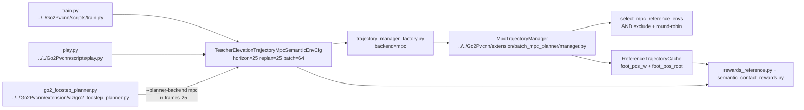

# Human MPC Planner Commands

## 导航

- 文档类型：`human` MPC planner 训练 / viewer / play 命令指南
- 对应 AI 文档：暂无
- 上一篇：[human-11-extension-trajectory-reward.md](human-11-extension-trajectory-reward.md)
- 下一篇：[human-13-batched-planner-swing-stance-ik-complexity.md](human-13-batched-planner-swing-stance-ik-complexity.md)
- 总索引：[../index.md](../index.md)

## 适用范围

这篇只覆盖当前 MPC semantic trajectory 主线：

- 训练入口：[../../Go2Pvcnn/scripts/train.py](../../Go2Pvcnn/scripts/train.py)
- 回放入口：[../../Go2Pvcnn/scripts/play.py](../../Go2Pvcnn/scripts/play.py)
- viewer 入口：[../../Go2Pvcnn/extension/viz/go2_foostep_planner.py](../../Go2Pvcnn/extension/viz/go2_foostep_planner.py)
- MPC manager：[../../Go2Pvcnn/extension/batch_mpc_planner/manager.py](../../Go2Pvcnn/extension/batch_mpc_planner/manager.py)
- MPC participation selector：[../../Go2Pvcnn/extension/batch_mpc_planner/participation.py](../../Go2Pvcnn/extension/batch_mpc_planner/participation.py)
- 真实语义 contact reward：[../../Go2Pvcnn/extension/mdp/semantic_contact_rewards.py](../../Go2Pvcnn/extension/mdp/semantic_contact_rewards.py)

当前主线实验名：

- `teacher_elevation_trajectory_mpc_semantic`

当前任务 cfg：

- [../../Go2Pvcnn/go2_pvcnn/tasks/teacher_elevation_trajectory_mpc_semantic_env_cfg.py](../../Go2Pvcnn/go2_pvcnn/tasks/teacher_elevation_trajectory_mpc_semantic_env_cfg.py)

当前关键合同：

- `planner_backend = "mpc"`
- `reference_trajectory_horizon = 25`
- `reference_replan_interval_steps = 25`
- `mpc_parallel_plan_batch_size = 64`
- `planner_owned_reference_cache = True`
- `reference_foot_pos_reward()` 使用 world-frame foot tracking
- 语义碰撞 reward 使用 IsaacLab filtered `ContactSensor.data.force_matrix_w`

`train.py` / `play.py` 的 `--planner-backend` 默认是 `None`，不传时会尊重 env cfg 里的 `planner_backend="mpc"`。实际跑命令时仍建议显式写 `--planner-backend mpc`，防止复制到其它 trajectory 实验时走错 backend。

## Mermaid 命令入口图



## 环境前提

从仓库根目录运行：

```bash
cd /mnt/mydisk/lhy/testPvcnnWithIsaacsim
```

使用 IsaacLab / IsaacSim conda 环境：

```bash
/mnt/mydisk/lhy/anaconda3/envs/env_isaacsim/bin/python
```

单卡运行时用 `CUDA_VISIBLE_DEVICES` 选卡，例如：

```bash
CUDA_VISIBLE_DEVICES=0 /mnt/mydisk/lhy/anaconda3/envs/env_isaacsim/bin/python ...
```

不要用 `base` 环境跑训练、viewer 或真实 IsaacLab smoke。

## 训练命令

最小 headless smoke：

```bash
CUDA_VISIBLE_DEVICES=0 /mnt/mydisk/lhy/anaconda3/envs/env_isaacsim/bin/python Go2Pvcnn/scripts/train.py \
  --headless \
  --device cuda:0 \
  --num_envs 32 \
  --max_iterations 1 \
  --experiment teacher_elevation_trajectory_mpc_semantic \
  --planner-backend mpc
```

1024 env / 64 MPC env 验收训练入口：

```bash
CUDA_VISIBLE_DEVICES=0 /mnt/mydisk/lhy/anaconda3/envs/env_isaacsim/bin/python Go2Pvcnn/scripts/train.py \
  --headless \
  --device cuda:0 \
  --num_envs 1024 \
  --max_iterations 1 \
  --experiment teacher_elevation_trajectory_mpc_semantic \
  --planner-backend mpc
```

常用单卡训练：

```bash
CUDA_VISIBLE_DEVICES=0 /mnt/mydisk/lhy/anaconda3/envs/env_isaacsim/bin/python Go2Pvcnn/scripts/train.py \
  --headless \
  --device cuda:0 \
  --num_envs 1024 \
  --max_iterations 5000 \
  --experiment teacher_elevation_trajectory_mpc_semantic \
  --planner-backend mpc
```

分布式训练：

```bash
GPU_IDS=0,1 /mnt/mydisk/lhy/anaconda3/envs/env_isaacsim/bin/python -m torch.distributed.run \
  --standalone \
  --nnodes=1 \
  --nproc_per_node=2 \
  Go2Pvcnn/scripts/train.py \
  --distributed \
  --headless \
  --num_envs 2048 \
  --max_iterations 5000 \
  --experiment teacher_elevation_trajectory_mpc_semantic \
  --planner-backend mpc
```

这里 `--num_envs` 按总 env 数写，脚本会按 `WORLD_SIZE` 分配到每张卡。

恢复训练：

```bash
CUDA_VISIBLE_DEVICES=0 /mnt/mydisk/lhy/anaconda3/envs/env_isaacsim/bin/python Go2Pvcnn/scripts/train.py \
  --headless \
  --device cuda:0 \
  --experiment teacher_elevation_trajectory_mpc_semantic \
  --planner-backend mpc \
  --resume \
  --load_run 2026-05-30_00-00-00 \
  --load_checkpoint model_0.pt
```

打印 planner / reward timing 诊断：

```bash
T302G_STEP_TIMING_STEPS=5 CUDA_VISIBLE_DEVICES=0 /mnt/mydisk/lhy/anaconda3/envs/env_isaacsim/bin/python Go2Pvcnn/scripts/train.py \
  --headless \
  --device cuda:0 \
  --num_envs 1024 \
  --max_iterations 1 \
  --experiment teacher_elevation_trajectory_mpc_semantic \
  --planner-backend mpc \
  --verbose-planner
```

## Viewer 命令

MPC semantic task headless scripted smoke：

```bash
CUDA_VISIBLE_DEVICES=0 timeout -s INT -k 20s 90s /mnt/mydisk/lhy/anaconda3/envs/env_isaacsim/bin/python \
  Go2Pvcnn/extension/viz/go2_foostep_planner.py \
  --headless \
  --device cuda:0 \
  --num_envs 1 \
  --terrain task \
  --planner-backend mpc \
  --n-frames 25 \
  --plan-dt 0.02 \
  --warmup-steps 0 \
  --scripted-command "0.20 0.00 0.00" \
  --scripted-command-cycles 1
```

本地交互 viewer：

```bash
CUDA_VISIBLE_DEVICES=0 /mnt/mydisk/lhy/anaconda3/envs/env_isaacsim/bin/python Go2Pvcnn/extension/viz/go2_foostep_planner.py \
  --device cuda:0 \
  --num_envs 1 \
  --terrain task \
  --planner-backend mpc \
  --n-frames 25 \
  --plan-dt 0.02
```

远程 WebRTC viewer：

```bash
CUDA_VISIBLE_DEVICES=2 /mnt/mydisk/lhy/anaconda3/envs/env_isaacsim/bin/python Go2Pvcnn/extension/viz/go2_foostep_planner.py \
  --headless \
  --livestream 2 \
  --webrtc-public-ip 172.31.179.75 \
  --device cuda:0 \
  --num_envs 1 \
  --terrain task \
  --planner-backend mpc \
  --n-frames 25 \
  --plan-dt 0.02
```

远程服务器上 `--webrtc-public-ip` 要填浏览器能访问到的服务器地址；不填时 viewer 会优先使用 `PUBLIC_IP`，再尝试从 `SSH_CONNECTION` 推断服务器 IP。默认 WebRTC port 是 `49100`；需要换端口时用 `--webrtc-port <port>`。

viewer 默认连续播放，不需要 `--step-mode`。运行时在终端按 `M` 进入单帧模式，再按 `M` 回连续播放。单帧模式下，每按一次空格只推进一次机器狗状态，并在同一节拍更新轨迹 marker；不按空格时 IsaacLab/Kit 窗口仍持续 render/pump。`W/A/S/D/Q/E/R` 仍监听。运动命令会锁存为下一段轨迹输入，当前轨迹未播放完时不会中途切换轨迹；`R` 仍即时 reset。

teleop 键位：

- `W/S`：前后速度
- `A/D`：横向速度
- `Q/E`：偏航速度
- `X`：清零命令
- `R`：reset，并触发重规划

## Play 命令

基础回放：

```bash
CUDA_VISIBLE_DEVICES=0 /mnt/mydisk/lhy/anaconda3/envs/env_isaacsim/bin/python Go2Pvcnn/scripts/play.py \
  --experiment teacher_elevation_trajectory_mpc_semantic \
  --planner-backend mpc \
  --run_dir 2026-05-30_00-00-00 \
  --checkpoint model_0.pt \
  --num_envs 1 \
  --device cuda:0
```

短视频 smoke：

```bash
CUDA_VISIBLE_DEVICES=0 /mnt/mydisk/lhy/anaconda3/envs/env_isaacsim/bin/python Go2Pvcnn/scripts/play.py \
  --headless \
  --device cuda:0 \
  --num_envs 1 \
  --experiment teacher_elevation_trajectory_mpc_semantic \
  --planner-backend mpc \
  --run_dir 2026-05-30_00-00-00 \
  --checkpoint model_0.pt \
  --video \
  --video_length 1 \
  --video_interval 1
```

远程 WebRTC 回放：

```bash
CUDA_VISIBLE_DEVICES=0 /mnt/mydisk/lhy/anaconda3/envs/env_isaacsim/bin/python Go2Pvcnn/scripts/play.py \
  --experiment teacher_elevation_trajectory_mpc_semantic \
  --planner-backend mpc \
  --run_dir 2026-05-30_00-00-00 \
  --checkpoint model_0.pt \
  --num_envs 1 \
  --headless \
  --livestream 2 \
  --device cuda:0
```

step-mode policy 回放：

```bash
CUDA_VISIBLE_DEVICES=0 /mnt/mydisk/lhy/anaconda3/envs/env_isaacsim/bin/python Go2Pvcnn/scripts/play.py \
  --experiment teacher_elevation_trajectory_mpc_semantic \
  --planner-backend mpc \
  --run_dir 2026-05-30_00-00-00 \
  --checkpoint model_0.pt \
  --num_envs 1 \
  --headless \
  --livestream 2 \
  --device cuda:0 \
  --step-mode
```

play 侧 `--step-mode` 需要显式开启；启用后每按一次空格推进一个 policy/env step，不按空格时仍保持 IsaacLab/Kit 窗口 render/pump。

## 关键参数解释

训练 / play 侧：

- `--experiment teacher_elevation_trajectory_mpc_semantic`
  进入 MPC + semantic grid trajectory reward 训练 / 回放路径。
- `--planner-backend mpc`
  使用 [../../Go2Pvcnn/extension/batch_mpc_planner](../../Go2Pvcnn/extension/batch_mpc_planner)。
- `--num_envs`
  并行环境数。当前 1024 env / 64 MPC env 已通过 25-step probe 和 1-iteration train entry。
- `--max_iterations`
  PPO 训练迭代数。连通性验证常用 `1`，正式训练可用 `5000`。
- `--distributed`
  启用多卡训练。分布式模式下 WebRTC livestream 会被脚本关闭。
- `--headless`
  无本地 GUI。
- `--device`
  IsaacLab / torch device，通常用 `cuda:0`。如果使用 `CUDA_VISIBLE_DEVICES=2`，进程内仍通常写 `--device cuda:0`。
- `--resume / --load_run / --load_checkpoint`
  恢复已有 run。
- `--verbose-planner`
  训练侧 planner timing 诊断，默认关闭。

viewer 侧：

- `--terrain task`
  使用 semantic MPC task terrain / scanner / reward cfg。
- `--planner-backend mpc`
  viewer attach 任务 manager，并通过 MPC backend 规划。
- `--n-frames 25`
  MPC horizon。当前训练和 viewer 都按 25 帧对齐。
- `--plan-dt 0.02`
  MPC 时间步长。
- `--warmup-steps`
  viewer 启动后零动作 warmup 步数。
- `--scripted-command "vx vy yaw_rate"`
  非交互 headless 诊断用固定速度命令。
- `--scripted-command-cycles`
  scripted command 保持的重规划 cycle 数。
- `--livestream`
  Isaac Sim WebRTC 模式，通常用 `2`。
- `--webrtc-public-ip`
  远程 WebRTC 对外地址。服务器远程浏览器黑屏时优先显式设置它，避免 IsaacLab 默认广告 `127.0.0.1`。
- `--webrtc-port`
  WebRTC livestream 端口，默认 `49100`。

env cfg 侧关键字段：

- `planner_backend = "mpc"`
- `reference_trajectory_horizon = 25`
- `reference_replan_interval_steps = 25`
- `plan_dt = 0.02`
- `mpc_parallel_plan_batch_size = 64`
- `planner_owned_reference_cache = True`
- `reference_height_scanner_name = "semantic_height_scanner"`
- `semantic_contact_collision` reward 使用 per-body small/large filtered contact sensors

这些字段主要在：

- [../../Go2Pvcnn/go2_pvcnn/tasks/teacher_elevation_trajectory_mpc_semantic_env_cfg.py](../../Go2Pvcnn/go2_pvcnn/tasks/teacher_elevation_trajectory_mpc_semantic_env_cfg.py)

## 当前已验证证据

截至 `2026-05-30` 的验证：

- focused local tests：`7 passed`
- backend / parametric tests：`140 passed, 1 warning`
- real IsaacLab semantic contact smoke：PASS
- 1024 env / 64 MPC env 25-step probe：`5.256s`
- real train entry：`1024 env`, `--max_iterations 1`, `--planner-backend mpc`，退出码 `0`
- low-small full matrix：`20` rows，`12` crossing-covered rows，FK semantic collision `0`，max crossing FK error `0.0634m`

记录：

- [../log/2026-05-30-2103-t302l-semantic-contact-smoke.md](../log/2026-05-30-2103-t302l-semantic-contact-smoke.md)
- [../log/2026-05-30-2114-t302l-rl-1024-64-performance.md](../log/2026-05-30-2114-t302l-rl-1024-64-performance.md)
- [../log/2026-05-30-2123-t302l-final-verification.md](../log/2026-05-30-2123-t302l-final-verification.md)

已知 caveat：

- IsaacLab/PhysX 会对全局 semantic course filtered contact pattern 输出 small/large filter count warning。当前 reward 和 sensors 能运行并区分 small/large；如果后续验收要求零 PhysX filter warning，需要单独处理全局语义物体的 contact 映射。

## 常见报错与第一检查点

`RuntimeError: No CUDA GPUs are available`

- 检查是否进了 `env_isaacsim`
- 检查 `--device` 和 `CUDA_VISIBLE_DEVICES`

`planner-owned reference cache requires env.unwrapped._trajectory_manager`

- 说明当前路径没有挂上 trajectory manager
- 对 `teacher_elevation_trajectory_mpc_semantic` 来说，这不是允许的正常训练路径

`horizon_s must equal the fixed 1.0s contract`

- 说明当前命令没有走到 MPC backend
- 检查命令是否写了 `--planner-backend mpc`
- 检查 cfg 是否仍是 `planner_backend = "mpc"`

`argument --terrain: invalid choice`

- 当前 viewer 使用 `--terrain task`

viewer 能启动但看不到 scripted 命令效果：

- 检查是否传了 `--scripted-command "vx vy yaw_rate"`
- 检查 `--scripted-command-cycles` 是否大于 `0`
- 检查 stdout 是否有 MPC planner / manager attach 信息

## 建议使用顺序

1. 先跑 `32 env / 1 iteration` train smoke，确认 MPC semantic 训练路径能启动
2. 再跑 `1024 env / 1 iteration`，确认 64 MPC env participation 性能
3. 再跑 viewer scripted smoke，确认 `--planner-backend mpc` 和 25 帧 horizon
4. 再跑正式单卡训练，例如 `1024 env / 5000 iterations`
5. 最后用 `play.py` 看训练出的 checkpoint 回放
