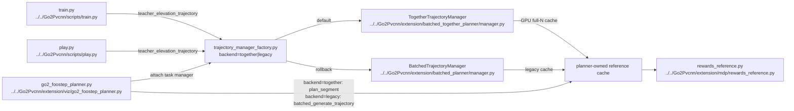

# Human Batched Planner Commands

## 导航

- 文档类型：`human` planner 训练 / viewer / play 命令指南
- 对应 AI 文档：暂无
- 上一篇：[human-11-extension-trajectory-reward.md](human-11-extension-trajectory-reward.md)
- 下一篇：[human-13-batched-planner-swing-stance-ik-complexity.md](human-13-batched-planner-swing-stance-ik-complexity.md)
- 总索引：[../index.md](../index.md)

## 适用范围

这篇覆盖当前 `teacher_elevation_trajectory` 主线命令：

- `Go2Pvcnn/scripts/train.py` 训练
- `Go2Pvcnn/scripts/play.py` 已训练策略回放
- `Go2Pvcnn/extension/viz/go2_foostep_planner.py` planner 可视化

当前默认 backend 是：

- `planner_backend = "together"`
- 对应实现：[../../Go2Pvcnn/extension/batched_together_planner](../../Go2Pvcnn/extension/batched_together_planner)
- 回滚 backend：`planner_backend = "legacy"`
- legacy 实现：[../../Go2Pvcnn/extension/batched_planner](../../Go2Pvcnn/extension/batched_planner)

训练路径现在必须走 planner-owned reference cache。正常训练 / reward 路径通过 [../../Go2Pvcnn/extension/trajectory_manager_factory.py](../../Go2Pvcnn/extension/trajectory_manager_factory.py) attach manager，不再把 placeholder / raw reference generator 当成正常 runtime。

## Mermaid 命令入口图



## 环境前提

推荐从仓库根目录运行：

```bash
cd /home/lhy/testPvcnnWithIsaacsim
```

推荐直接使用 IsaacLab conda 环境里的 Python：

```bash
/home/lhy/anaconda3/envs/env_isaaclab/bin/python
```

不要用 `base` 环境直接跑训练；当前验证以 `/home/lhy/anaconda3/envs/env_isaaclab/bin/python` 为准。

## 训练命令

最小 headless smoke：

```bash
/home/lhy/anaconda3/envs/env_isaaclab/bin/python Go2Pvcnn/scripts/train.py \
  --headless \
  --device cuda:0 \
  --num_envs 32 \
  --max_iterations 1 \
  --experiment teacher_elevation_trajectory \
  --planner-backend together
```

常用单卡训练：

```bash
/home/lhy/anaconda3/envs/env_isaaclab/bin/python Go2Pvcnn/scripts/train.py \
  --headless \
  --device cuda:0 \
  --num_envs 2048 \
  --max_iterations 5000 \
  --experiment teacher_elevation_trajectory \
  --planner-backend together
```

`--planner-backend together` 当前是默认值，但建议显式写上，避免后续默认值变化或命令复制时踩坑。

legacy 回滚训练：

```bash
/home/lhy/anaconda3/envs/env_isaaclab/bin/python Go2Pvcnn/scripts/train.py \
  --headless \
  --device cuda:0 \
  --num_envs 512 \
  --max_iterations 5000 \
  --experiment teacher_elevation_trajectory \
  --planner-backend legacy
```

分布式训练：

```bash
GPU_IDS=0,1 /home/lhy/anaconda3/envs/env_isaaclab/bin/python -m torch.distributed.run \
  --standalone \
  --nnodes=1 \
  --nproc_per_node=2 \
  Go2Pvcnn/scripts/train.py \
  --distributed \
  --headless \
  --num_envs 8192 \
  --max_iterations 5000 \
  --experiment teacher_elevation_trajectory \
  --planner-backend together
```

这里 `--num_envs` 按总 env 数写，脚本会按 `WORLD_SIZE` 分配到每张卡。

恢复训练：

```bash
/home/lhy/anaconda3/envs/env_isaaclab/bin/python Go2Pvcnn/scripts/train.py \
  --headless \
  --device cuda:0 \
  --experiment teacher_elevation_trajectory \
  --planner-backend together \
  --resume \
  --load_run 2026-04-27_19-13-54 \
  --load_checkpoint model_0.pt
```

打印 planner 诊断：

```bash
/home/lhy/anaconda3/envs/env_isaaclab/bin/python Go2Pvcnn/scripts/train.py \
  --headless \
  --device cuda:0 \
  --num_envs 32 \
  --max_iterations 1 \
  --experiment teacher_elevation_trajectory \
  --planner-backend together \
  --verbose-planner
```

## Viewer 命令

headless scripted smoke：

```bash
timeout -s INT -k 20s 60s /home/lhy/anaconda3/envs/env_isaaclab/bin/python \
  Go2Pvcnn/extension/viz/go2_foostep_planner.py \
  --headless \
  --device cuda:0 \
  --num_envs 1 \
  --terrain task \
  --planner-backend together \
  --n-frames 35 \
  --plan-dt 0.02 \
  --warmup-steps 0 \
  --scripted-command "0.20 0.00 0.00" \
  --scripted-command-cycles 1
```

本地交互 viewer：

```bash
/home/lhy/anaconda3/envs/env_isaaclab/bin/python Go2Pvcnn/extension/viz/go2_foostep_planner.py \
  --device cuda:0 \
  --num_envs 1 \
  --terrain task \
  --planner-backend together
```

远程 WebRTC viewer：

```bash
/home/lhy/anaconda3/envs/env_isaaclab/bin/python Go2Pvcnn/extension/viz/go2_foostep_planner.py \
  --headless \
  --livestream 2 \
  --device cuda:0 \
  --num_envs 1 \
  --terrain task \
  --planner-backend together
```

legacy viewer 回滚：

```bash
/home/lhy/anaconda3/envs/env_isaaclab/bin/python Go2Pvcnn/extension/viz/go2_foostep_planner.py \
  --headless \
  --device cuda:0 \
  --num_envs 1 \
  --terrain task \
  --planner-backend legacy
```

teleop 键位：

- `W/S`：前后速度
- `A/D`：横向速度
- `Q/E`：偏航速度
- `X`：清零命令
- `R`：reset，并触发重规划

## Play 命令

基础回放：

```bash
/home/lhy/anaconda3/envs/env_isaaclab/bin/python Go2Pvcnn/scripts/play.py \
  --experiment teacher_elevation_trajectory \
  --planner-backend together \
  --run_dir 2026-04-27_19-13-54 \
  --checkpoint model_0.pt \
  --num_envs 1 \
  --device cuda:0
```

短视频 smoke：

```bash
/home/lhy/anaconda3/envs/env_isaaclab/bin/python Go2Pvcnn/scripts/play.py \
  --headless \
  --device cuda:0 \
  --num_envs 1 \
  --experiment teacher_elevation_trajectory \
  --planner-backend together \
  --run_dir 2026-04-27_19-13-54 \
  --checkpoint model_0.pt \
  --video \
  --video_length 1 \
  --video_interval 1
```

远程 WebRTC 回放：

```bash
/home/lhy/anaconda3/envs/env_isaaclab/bin/python Go2Pvcnn/scripts/play.py \
  --experiment teacher_elevation_trajectory \
  --planner-backend together \
  --run_dir 2026-04-27_19-13-54 \
  --checkpoint model_0.pt \
  --num_envs 1 \
  --headless \
  --livestream 2 \
  --device cuda:0
```

legacy 回放：

```bash
/home/lhy/anaconda3/envs/env_isaaclab/bin/python Go2Pvcnn/scripts/play.py \
  --experiment teacher_elevation_trajectory \
  --planner-backend legacy \
  --run_dir 2026-04-27_19-13-54 \
  --checkpoint model_0.pt \
  --num_envs 1 \
  --headless \
  --device cuda:0
```

## 关键参数解释

训练 / play 侧：

- `--experiment teacher_elevation_trajectory`
  进入高分辨率 elevation + trajectory reward 训练 / 回放路径。
- `--planner-backend together`
  使用 native GPU full-N together planner。当前默认值也是 `together`。
- `--planner-backend legacy`
  使用旧 `extension.batched_planner` 作为回滚路径。
- `--num_envs`
  并行环境数。已验证 `32` / `128` 的 1-iteration together 训练；长训常用可以从 `2048` 起。
- `--max_iterations`
  PPO 训练迭代数。连通性验证常用 `1`，正式训练可用 `5000`。
- `--distributed`
  启用多卡训练。分布式模式下 WebRTC livestream 会被脚本关闭。
- `--headless`
  无本地 GUI。
- `--device`
  IsaacLab / torch device，通常用 `cuda:0`。
- `--resume / --load_run / --load_checkpoint`
  恢复已有 run。
- `--verbose-planner`
  训练侧 planner timing 诊断，默认关闭。

viewer 侧：

- `--terrain task`
  当前 viewer 只支持 `task`，表示严格使用 `teacher_elevation_trajectory` 任务配置里的 terrain generator。
- `--planner-backend together|legacy`
  `together` 时 viewer 实际调用 `extension.batched_together_planner.planner.plan_segment`；`legacy` 时调用旧 `batched_generate_trajectory`。
- `--n-frames`
  planner horizon。together 固定合同是 `35`。
- `--plan-dt`
  planner 时间步长。together 固定合同是 `0.02`。
- `--warmup-steps`
  viewer 启动后零动作 warmup 步数。
- `--scripted-command "vx vy yaw_rate"`
  非交互 headless 诊断用固定速度命令。
- `--scripted-command-cycles`
  scripted command 保持的重规划 cycle 数。
- `--livestream`
  Isaac Sim WebRTC 模式，通常用 `2`。

env cfg 侧关键字段：

- `planner_backend`
- `reference_trajectory_horizon = 35`
- `reference_replan_interval_steps = 35`
- `plan_dt = 0.02`
- `planner_owned_reference_cache = True`
- `step_freq`
- `step_height`

这些字段主要在：

- [../../Go2Pvcnn/go2_pvcnn/tasks/teacher_elevation_trajectory_env_cfg.py](../../Go2Pvcnn/go2_pvcnn/tasks/teacher_elevation_trajectory_env_cfg.py)

## 当前已验证证据

截至 `2026-04-27` 的 `env_isaaclab` 验证：

- together `32` env, `max_iterations=1`：通过
- together `128` env, `max_iterations=1`：通过
- legacy `16` env, `max_iterations=1`：通过
- together CUDA benchmark `N=1024` / `N=4096`：通过
- 真实 Isaac env cadence/full-N：reset、单 env command change、35-frame interval、command hook 都保持 full-N planner call
- viewer `--planner-backend together`：确认实际走 together `plan_segment`
- viewer `--planner-backend legacy`：确认 legacy 回滚可用

仍未覆盖：

- 多 iteration 长训练
- `num_envs > 128` 的真实训练吞吐
- 多 GPU 分布式长训
- 长时间显存 / throughput 漂移
- 复杂地形 support / CEM raw parity

## 常见报错与第一检查点

`RuntimeError: No CUDA GPUs are available`

- 先检查是不是进了 `env_isaaclab`
- 再检查 `--device` 和 `CUDA_VISIBLE_DEVICES`

`planner-owned reference cache requires env.unwrapped._trajectory_manager`

- 说明当前路径没有挂上 trajectory manager
- 对 `teacher_elevation_trajectory` 来说，这不是允许的正常训练路径

`teacher_elevation_trajectory requires planner_owned_reference_cache=True`

- 说明 env cfg 被改坏，或者不是当前 planner-owned 配置

`argument --terrain: invalid choice`

- 说明还在用旧文档里的 `flat / stairs / mixed`
- 当前 viewer 只接受 `--terrain task`

viewer 能启动但看不到 scripted 命令效果：

- 检查是否传了 `--scripted-command "vx vy yaw_rate"`
- 检查 `--scripted-command-cycles` 是否大于 `0`
- 检查 stdout 是否有 `[Viewer][Plan] backend=together ... standstill=False`

## 建议使用顺序

1. 先跑 `32 env / 1 iteration` train smoke，确认 together 训练路径能启动
2. 再跑 viewer scripted smoke，确认 `backend=together` 实际进入 together planner
3. 再跑正式单卡训练，例如 `2048 env / 5000 iterations`
4. 需要对照时用 `--planner-backend legacy` 做回滚验证
5. 最后用 `play.py` 看训练出的 checkpoint 回放
