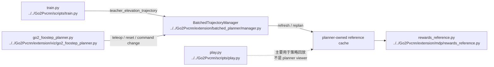

# Human Batched Planner Commands

## 导航

- 文档类型：`human` planner 训练 / viewer / play 命令指南
- 对应 AI 文档：暂无
- 上一篇：[human-11-extension-trajectory-reward.md](human-11-extension-trajectory-reward.md)
- 下一篇：无
- 总索引：[../index.md](../index.md)

## 适用范围

这篇只覆盖当前已经收敛好的 batched planner 主线：

- `teacher_elevation_trajectory` 训练
- `extension/viz/go2_foostep_planner.py` 可视化
- `scripts/play.py` 已训练策略回放

其中最重要的约束是：

- `teacher_elevation_trajectory` 现在是 **planner-only**
- 正常训练 / reward 路径必须通过 `BatchedTrajectoryManager`
- 不再把 placeholder / raw reference generator 当成正常 runtime 路径

## Mermaid 命令入口图



## 训练命令

环境前提：

- 推荐直接用 `conda run -n env_isaaclab ...`
- 如果你手动开终端运行，也要先 `conda activate env_isaaclab`
- 不要用 `base` 环境直接跑；当前机器上的 `base` 是 CPU 版 `torch`

最小 headless smoke：

```bash
conda run -n env_isaaclab python Go2Pvcnn/scripts/train.py \
  --headless \
  --num_envs 1 \
  --max_iterations 1 \
  --experiment teacher_elevation_trajectory
```

常用单卡训练：

```bash
conda run -n env_isaaclab python Go2Pvcnn/scripts/train.py \
  --headless \
  --num_envs 4096 \
  --max_iterations 5000 \
  --experiment teacher_elevation_trajectory
```

分布式训练：

```bash
conda run -n env_isaaclab python -m torch.distributed.run --standalone --nnodes=1 --nproc_per_node=2 \
  Go2Pvcnn/scripts/train.py \
  --distributed \
  --headless \
  --num_envs 8192 \
  --max_iterations 5000 \
  --experiment teacher_elevation_trajectory
```

恢复训练：

```bash
conda run -n env_isaaclab python Go2Pvcnn/scripts/train.py \
  --headless \
  --experiment teacher_elevation_trajectory \
  --resume \
  --load_run 2026-04-14_12-00-00 \
  --load_checkpoint model_1000.pt
```

## Viewer 命令

本地 / 远程 WebRTC viewer：

```bash
conda run -n env_isaaclab python Go2Pvcnn/extension/viz/go2_foostep_planner.py \
  --headless \
  --livestream 2 \
  --device cuda:0 \
  --terrain mixed
```

只看平地：

```bash
conda run -n env_isaaclab python Go2Pvcnn/extension/viz/go2_foostep_planner.py \
  --headless \
  --livestream 2 \
  --device cuda:0 \
  --terrain flat
```

只看楼梯：

```bash
conda run -n env_isaaclab python Go2Pvcnn/extension/viz/go2_foostep_planner.py \
  --headless \
  --livestream 2 \
  --device cuda:0 \
  --terrain stairs
```

teleop 键位：

- `W/S`：前后速度
- `A/D`：横向速度
- `Q/E`：偏航速度
- `X`：清零命令
- `R`：reset，并立即触发 manager replan

## Play 命令

基础回放：

```bash
conda run -n env_isaaclab python Go2Pvcnn/scripts/play.py \
  --experiment teacher_elevation_trajectory \
  --run_dir 2026-04-14_12-00-00 \
  --checkpoint model_1600.pt \
  --num_envs 1
```

远程 WebRTC 回放：

```bash
conda run -n env_isaaclab python Go2Pvcnn/scripts/play.py \
  --experiment teacher_elevation_trajectory \
  --run_dir 2026-04-14_12-00-00 \
  --checkpoint model_1600.pt \
  --num_envs 1 \
  --headless \
  --livestream 2
```

## 关键参数解释

训练侧：

- `--experiment teacher_elevation_trajectory`
  这会进入 planner-only 训练路径。
- `--num_envs`
  并行环境数。大规模 smoke 常用 `4096`。
- `--max_iterations`
  PPO 训练迭代数。连通性验证常用 `1`。
- `--distributed`
  启用多卡训练。
- `--headless`
  无本地 GUI。
- `--resume / --load_run / --load_checkpoint`
  恢复已有 run。

viewer 侧：

- `--terrain`
  `flat / stairs / mixed`。
- `--n-frames`
  planner horizon。
- `--plan-dt`
  planner 时间步长。
- `--vx-scale / --vy-scale / --yaw-scale`
  teleop 命令缩放。
- `--warmup-steps`
  viewer 启动后零动作 warmup 步数。
- `--livestream`
  Isaac Sim WebRTC 模式，通常用 `2`。

env cfg 侧关键字段：

- `reference_trajectory_horizon`
- `reference_replan_interval_steps`
- `replan_velocity_scales`
- `replan_yaw_biases`
- `replan_vy_biases`
- `replan_stop_speed`
- `planner_owned_reference_cache`

这些字段主要在：

- `../../Go2Pvcnn/go2_pvcnn/tasks/teacher_elevation_trajectory_env_cfg.py`

## 常见报错与第一检查点

`RuntimeError: No CUDA GPUs are available`

- 先检查是不是进了 `env_isaaclab`
- 当前机器上的 `base` 环境是 `torch 2.11.0+cpu`，会直接看不到 GPU
- `env_isaaclab` 里才是 CUDA 版 `torch 2.10.0+cu128`
- 再检查 `--device` 和 `CUDA_VISIBLE_DEVICES`

`planner-owned reference cache requires env.unwrapped._trajectory_manager`

- 说明当前路径没有挂上 `BatchedTrajectoryManager`
- 对 `teacher_elevation_trajectory` 来说，这已经不是允许的正常路径

`teacher_elevation_trajectory requires planner_owned_reference_cache=True`

- 说明 env cfg 被改坏，或者不是当前 planner-only 配置

`batched base solver requires all tensor inputs to live on one device`

- 检查 robot state、terrain、scanner hits 是否在同一 device
- viewer / train 当前都应该走统一 manager path，正常情况下不应再手工混设备

viewer 能启动但不重规划：

- 先看 teleop 命令是否真的写进 shared command 通道
- 再看 reset / command change 是否进入 manager 的 immediate replan 分支

## 现在的建议使用顺序

1. 先跑最小 train smoke，确认 planner-only 训练路径能启动
2. 再跑 viewer，确认 teleop 下 reset / command change 会触发 replan
3. 最后再用 `play.py` 看训练出的 checkpoint 回放
